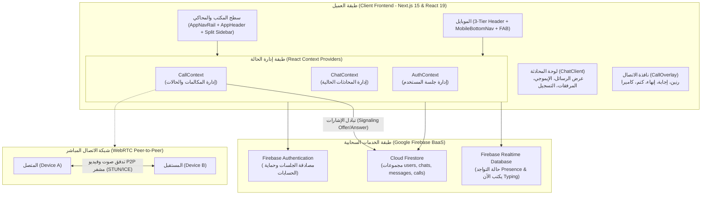
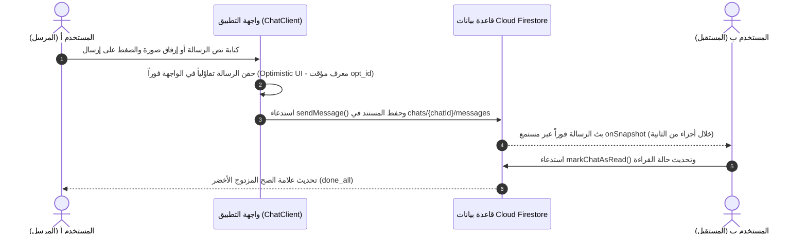
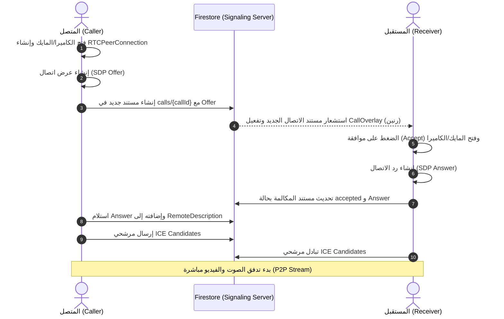

# 🏛️ معمارية النظام وتدفق البيانات (System Architecture & Data Flow)

تعتمد معمارية **Youssef App** على نموذج معماري موزع بدون خادم مركزي تقليدي (**Serverless Real-Time Architecture**)، مما يمنح التطبيق سرعة قصوى في معالجة البيانات وانعدام أوقات التوقف (High Availability).

---

## 1. مخطط المعمارية الشامل (System Architecture Diagram)

---

## 2. تدفق المراسلة الفورية في نفس الثانية (Real-Time Messaging Flow)

### مزايا هذا النموذج:
1. **استجابة فورية بدون انتظار**: يرى المرسل رسالته تظهر فوراً قبل حتى أن يعود رد السيرفر.
2. **استماع دائم خفيف**: مستمع `onSnapshot` يستهلك أقل حجم بيانات ممكن ويرسل فقط التغييرات الجديدة (Delta updates).

---

## 3. تدفق مكالمات الصوت والفيديو (WebRTC Signaling Flow)

تتم إشارات الاتصال (Signaling) عبر مجموعة `calls` في Firestore دون الحاجة لسيرفرات WebSocket مكلفة:

---

## 4. نظام أكواد المستخدمين الفريدة (Unique User Code System)

1. **التوليد**: عند تسجيل أي حساب جديد، يتم استدعاء دالة توليد رقمية ذكية تنتج كوداً فريداً من 6 خانات (مثل `#742195`).
2. **التحقق من عدم التكرار**: يفحص Firestore وجود الكود مسبقاً، وإذا وجد يعيد التوليد لضمان عدم تكرار أي كود نهائياً.
3. **البحث المباشر**: يمكن لأي شخص كتابة كود المستخدم مثل `742195` في شريط البحث للوصول للشخص في جزء من الثانية والبدء في محادثته.
4. **حساب الدعم الفني الرسمي (`#123`)**: كود ثابت ومحجوز لحساب الدعم الفني، متاح لجميع المستخدمين ومثبت في أعلى قائمة المحادثات.

---

## 5. نظام الحظر وحماية الخصوصية (Blocking & Privacy Layer)

- يحتوي مستند كل مستخدم في مجموعة `users` على مصفوفة `blockedUsers: string[]`.
- **عند الحظر**: يضاف معرف الشخص (`targetUid`) للمصفوفة.
- **التأثير الفوري**:
  - يظهر وسم `(محظور 🚫)` بجانب اسم المستخدم.
  - يتم تعطيل أزرار الاتصال الصوتي والمرئي فوراً.
  - يتم منع إرسال الرسائل للشخص المحظور مع رسالة تنبيه واضحة.
  - يمكن فك الحظر في أي وقت بنقرة واحدة من شاشة الملف الشخصي.
