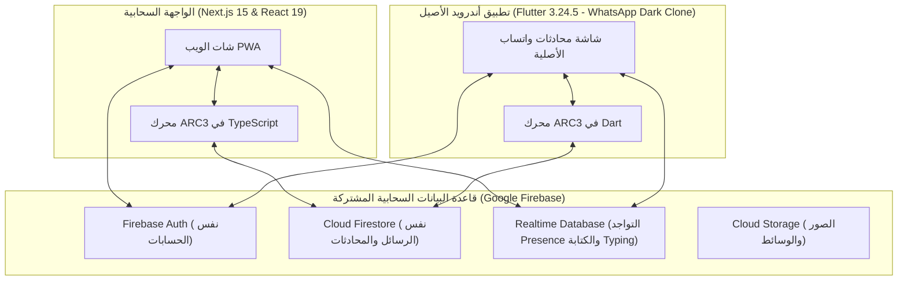

# 📱 التقرير الحادي عشر: تطبيق أندرويد الأصيل (Flutter) ونسخة واتساب المطابقة 100%

يوثق هذا التقرير التفاصيل الهندسية الكاملة لتحويل المنصة وبناء تطبيق أندرويد حقيقي أصيل (Native Android App) باستخدام **Flutter 3.24.5** و **Dart 3.5.4** داخل مجلد مستقل في المشروع ([`youssef_app_mobile/`](file:///c:/Users/youse/OneDrive/Desktop/youssef%20app/youssef_app_mobile))، متصل بنفس قاعدة بيانات **Firebase** الأصلية عبر [`google-services.json`](file:///c:/Users/youse/OneDrive/Desktop/youssef%20app/google-services.json)، وبواجهة متطابقة 1:1 (Copy-Paste) مع تطبيق **WhatsApp** الأصلي على الهواتف، مع توفير ملف **APK** للتحميل المباشر من الموقع.

---

## 1. 🎯 نظرة عامة والمعمارية المزدوجة (Cross-Platform Sync Architecture)

---

## 2. 🔐 التوافق التام لمحرك التشفير اليومي الدوار (ARC3 Engine in Dart)

لضمان أن الرسالة التي يرسلها مستخدم الموقع تظهر مفكوكة الشفرة في نفس الثانية لمستخدم تطبيق الفلاتر على هاتفه (والعكس)، تم نقل وتطبيق خوارزمية **ARC3** بالكامل في ملف [`lib/core/utils/encryption_helper.dart`](file:///c:/Users/youse/OneDrive/Desktop/youssef%20app/youssef_app_mobile/lib/core/utils/encryption_helper.dart):

1. **المفتاح السري المشترك**:
   `YOUSSEF_APP_ULTRA_SECURE_CIPHER_KEY_2026_CMYK_ARCHIVE_SEC`
2. **اشتقاق اليوم (Epoch Index)**:
   يتم حساب عدد الأيام المنقضية منذ `2025-01-01` بتوقيت UTC لتوليد نفس Keystream و S-Box الديناميكي.
3. **التشويش والتبديل (Non-linear Permutation)**:
   تنفيذ دوال الضرب السريع `_imul` لمحاكاة `Math.imul` في JavaScript بدقة 32-bit.
4. **التوافق مع الأرشيف القديم**:
   فك تشفير الرسائل القديمة التي تبدأ بـ `🔒#YF:` أو `ARC3$` بدون أي خطأ.

---

## 3. 🎨 واجهة واتساب أندرويد الأصلية بالوضع الداكن (1:1 WhatsApp Dark UI)

تم تصميم التطبيق ليكون نسخة طبق الأصل من واجهة واتساب أندرويد الرسمية:

| العنصر | التفاصيل الهندسية في Flutter |
| :--- | :--- |
| **خلفية الشاشة** | كود اللون `#111B21` مع شريط التطبيق `#1F2C34`. |
| **خلفية الشات (Wallpaper)** | كود مخصص `WhatsAppWallpaper` يرسم نقوش الدودل الأصلية لواتساب بدقة عالية. |
| **فقاعات الرسائل** | فقاعة مرسل بلون `#005C4B` مع ذيل منحني ووقت الإرسال والصح المزدوج الأزرق (`#53BDEB`). فقاعة مستقبل بلون `#202C33`. |
| **شريط التبويبات (Tabs)** | 4 تبويبات رسمية: المجتمعات، الدردشات (مع بادج أخضر للرسائل غير المقروءة)، المستجدات (الحالات)، والمكالمات. |
| **محادثة الدعم الفني** | مثبتة في قمة القائمة بالأيقونة الرمزية وبادج `24/7` وكود الحساب الرسمي `#123`. |
| **شريط الكتابة** | حاوية بيضاوية داكنة مع أيقونة الإيموجي، مشبك المرفقات (المعرض، الكاميرا)، وزر المايك الأخضر الدائري المنفصل. |
| **الزر العائم (FAB)** | زر أخضر دائري بقطر 56px (`#00A884`) بأيقونة الشات في أسفل الشاشة. |

---

## 4. 📦 تحميل ملف الـ APK المباشر من الموقع

تم تحديث الموقع ليتيح لأي هاتف أندرويد تحميل ملف الـ APK الحقيقي بنقرة واحدة كبديل للـ PWA:
1. **في شريط الهيدر العلوي ([`AppHeader.tsx`](file:///c:/Users/youse/OneDrive/Desktop/youssef%20app/src/components/chat/AppHeader.tsx))**:
   - إضافة أيقونة أندرويد الخضراء المباشرة لتحميل الملف `/youssef-app.apk`.
2. **في شريط التثبيت ([`PWAInstallBanner.tsx`](file:///c:/Users/youse/OneDrive/Desktop/youssef%20app/src/components/pwa/PWAInstallBanner.tsx))**:
   - إضافة زر أخضر مميز: **"تحميل APK 📥"** يوجه فوراً لتحميل الملف وتثبيته على الهاتف.
3. **سكربت البناء بنقرة واحدة ([`build_apk.bat`](file:///c:/Users/youse/OneDrive/Desktop/youssef%20app/build_apk.bat))**:
   - يقوم ببناء تطبيق الأندرويد في ثوانٍ ونسخ ملف `app-release.apk` تلقائياً إلى مجلد الموقع العام `public/youssef-app.apk`.
